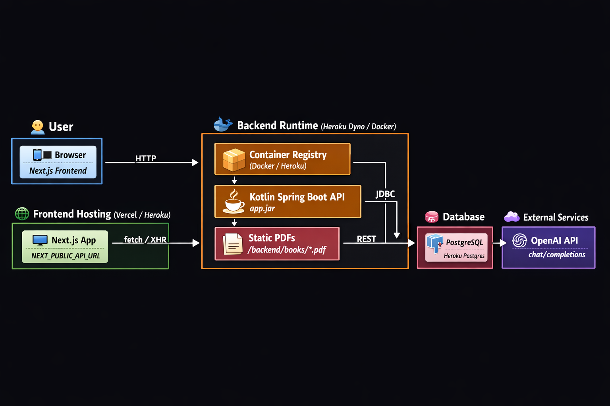

# 🤖 AI Agent Story Book

An intelligent story generation platform that uses AI to help create and modify stories based on uploaded books.

## Architecture diagram:


## 🌟 Features

- 📚 **PDF Book Upload & Processing**: Upload PDF books for AI analysis
- 🤖 **AI-Powered Chat**: Interact with ChatGPT to generate and modify stories
- ✏️ **Story Editing**: Edit and refine AI-generated content
- 📖 **Book Management**: Organize and manage your book collection
- 🔄 **Version Control**: Track different versions of your stories

## 🚀 Live Demo

- **🌐 Frontend**: https://ai-story-book-frontend-543348ab1276.herokuapp.com
- **⚙️ Backend API**: https://ai-story-book-backend-366deb5178f1.herokuapp.com

## Deployment
```bash
bash /Users/petyamarinova/Documents/ai-agent-story-book/scripts/deploy_backend_and_frontend.sh
```

## 🛠️ Technology Stack

### Backend (Spring Boot + Kotlin)
- **Framework**: Spring Boot 3.2.2
- **Language**: Kotlin
- **Database**: PostgreSQL with Flyway migrations
- **AI Integration**: OpenAI GPT-4o-mini
- **PDF Processing**: Apache PDFBox
- **API**: RESTful API with CORS support

### Frontend (Next.js + React)
- **Framework**: Next.js 13.5.4
- **Language**: TypeScript
- **Styling**: SCSS
- **State Management**: SWR for data fetching
- **Markdown**: React Markdown with syntax highlighting

## 🚀 Quick Start

### Prerequisites
- Node.js 18+
- Java 17+
- PostgreSQL
- OpenAI API Key

### Local Development

1. **Clone the repository**
   ```bash
   git clone https://github.com/petya0111/ai-agent-story-book.git
   cd ai-agent-story-book
   ```

2. **Backend Setup**
   ```bash
   cd backend
   # Set up environment variables
   cp .env.example .env
   # Edit .env with your OpenAI API key and database settings
   
   # Run with Docker
   docker compose up -d
   ```

3. **Frontend Setup**
   ```bash
   cd frontend
   npm install
   npm run dev
   ```

4. **Access the application**
   - Frontend: http://localhost:3000
   - Backend API: http://localhost:8080

## 🚀 One-Button Deployment

This project includes GitHub Actions CI/CD for seamless deployment to Heroku.

### 🔧 Setup (One-time)
1. **Get Heroku API Key**: [Account Settings](https://dashboard.heroku.com/account) → API Key → Reveal
2. **Add GitHub Secrets**: 
   - `HEROKU_API_KEY`: Your Heroku API key
   - `HEROKU_EMAIL`: Your Heroku email
3. **Location**: Repository Settings → Secrets and variables → Actions

### 🎯 Deploy Options

#### 🔄 Automatic Deployment
- **Trigger**: Push to `main` branch
- **Action**: Automatically deploys both frontend and backend

#### 🎮 Manual Deployment  
1. Go to **Actions** tab in GitHub
2. Select **"Manual Deploy"**
3. Click **"Run workflow"**
4. Choose your options and deploy!

### 📊 Deployment Features
✅ Automated testing  
✅ Health checks  
✅ Rollback support  
✅ Environment selection  
✅ Selective deployment (backend/frontend/both)  

> 📖 **Full deployment guide**: See [DEPLOYMENT.md](./DEPLOYMENT.md) and [GITHUB_SETUP.md](./GITHUB_SETUP.md)

## 📡 API Endpoints

### Books
- `GET /api/book/metadata` - List all books
- `GET /api/book/pages?bookId={id}&start={n}&end={n}` - Get page chunks
- `GET /api/book/chunks/{id}` - Get specific chunk

### Stories  
- `POST /api/stories` - Create new story version
- `GET /api/stories?bookId={id}` - List stories for a book
- `POST /api/stories/{id}/revert` - Revert to previous version

### AI Generation
- `POST /api/generate/chat` - Chat with AI about stories
- `POST /api/generate/hero-rewrite` - AI-powered character rewriting

## 🎯 Usage

1. **Upload a Book**: Add PDF files for AI processing
2. **Chat with AI**: Ask questions or request story modifications
3. **Generate Stories**: Use AI to create new narrative content
4. **Edit & Refine**: Modify AI-generated content to your liking
5. **Save Versions**: Keep track of different story iterations

## 🔧 Environment Variables

### Backend (.env)
```bash
# Database
DB_HOST=localhost
DB_PORT=5432
DB_NAME=bookdb
DB_USER=postgres
DB_PASSWORD=postgres

# OpenAI
OPENAI_API_KEY=your-openai-api-key

# App
APP_PORT=8080
SPRING_PROFILES_ACTIVE=local
```

### Frontend (.env.local)
```bash
NEXT_PUBLIC_API_URL=http://localhost:8080/api
```

## 🤝 Contributing

1. Fork the repository
2. Create a feature branch (`git checkout -b feature/amazing-feature`)
3. Commit your changes (`git commit -m 'Add amazing feature'`)
4. Push to the branch (`git push origin feature/amazing-feature`)
5. Open a Pull Request

## 📄 License

This project is licensed under the MIT License - see the [LICENSE](LICENSE) file for details.

## 🆘 Support

- 📖 **Documentation**: [DEPLOYMENT.md](./DEPLOYMENT.md)
- 🚀 **Quick Setup**: [GITHUB_SETUP.md](./GITHUB_SETUP.md)
- 🐛 **Issues**: [GitHub Issues](https://github.com/petya0111/ai-agent-story-book/issues)

---

**Built with ❤️ using Spring Boot, Next.js, and OpenAI**