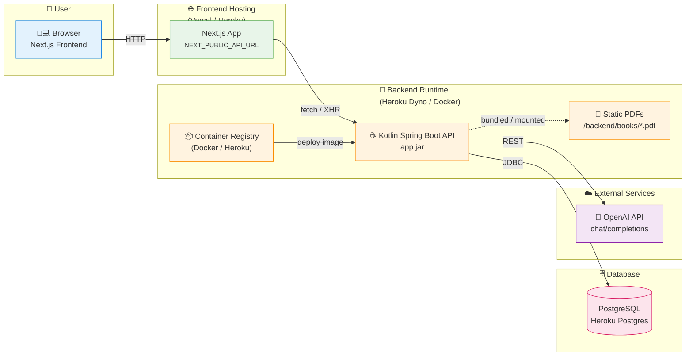

## Архитектурна диаграма — Frontend, Backend, Docker и база данни

По-долу има Mermaid диаграма и алтернативен ASCII вариант, описващи основните компоненти във вашия проект: Next.js фронтенд, Kotlin Spring Boot бекенд (в Docker контейнер), Postgres базата (Heroku Postgres), Docker Registry / Heroku Container Registry и външния OpenAI API. Всички описания са на български.

### Mermaid диаграма


```mermaid
flowchart LR
  %% ========== USER ==========
  subgraph U["👤 User"]
    B["📱💻 Browser<br/>Next.js Frontend"]
  end

  %% ========== FRONTEND ==========
  subgraph FE["🌐 Frontend Hosting<br/>(Vercel / Heroku)"]
    FE_APP["Next.js App<br/><small>NEXT_PUBLIC_API_URL</small>"]
  end

  %% ========== BACKEND ==========
  subgraph BE["🐳 Backend Runtime<br/>(Heroku Dyno / Docker)"]
    REG["📦 Container Registry<br/>(Docker / Heroku)"]
    API["☕ Kotlin Spring Boot API<br/>app.jar"]
    PDF["📄 Static PDFs<br/>/backend/books/*.pdf"]
  end

  %% ========== DATABASE ==========
  subgraph DB["🗄️ Database"]
    PG[("PostgreSQL<br/>Heroku Postgres")]
  end

  %% ========== EXTERNAL ==========
  subgraph EXT["☁️ External Services"]
    AI["🤖 OpenAI API<br/>chat/completions"]
  end

  %% ========== FLOWS ==========
  B -->|HTTP| FE_APP
  FE_APP -->|fetch / XHR| API

  API -->|JDBC| PG
  API -->|REST| AI

  REG -->|deploy image| API
  API -.->|bundled / mounted| PDF

  %% ========== STYLES ==========
  classDef user fill:#E3F2FD,stroke:#1E88E5,stroke-width:1px;
  classDef frontend fill:#E8F5E9,stroke:#43A047,stroke-width:1px;
  classDef backend fill:#FFF3E0,stroke:#FB8C00,stroke-width:1px;
  classDef database fill:#FCE4EC,stroke:#D81B60,stroke-width:1px;
  classDef external fill:#F3E5F5,stroke:#8E24AA,stroke-width:1px;

  class B user;
  class FE_APP frontend;
  class API,REG,PDF backend;
  class PG database;
  class AI external;

  %% ========== LINKS ==========
  click REG "https://devcenter.heroku.com/articles/container-registry-and-runtime" "Heroku Container Registry"
  click AI "https://platform.openai.com/docs/api-reference" "OpenAI API"

```

### Обяснение (на български)

- Browser / Frontend: Потребителският интерфейс е Next.js приложение. То извиква бекенд API-то през променливата среда `NEXT_PUBLIC_API_URL`.
- Backend: Kotlin + Spring Boot приложение опаковано като Docker image (в `backend/container-build/app.jar`). При build процеса Gradle генерира bootJar, след което се билдва Docker image и се push-ва към Registry (Heroku Container Registry в нашия случай).
- Docker Registry: Тук се качва контейнерният образ; Heroku го използва за release на dyno.
- PDF (hale.pdf): Файловете за ingest (напр. `backend/books/hale.pdf`) обикновено са включени в контейнера по време на билд или могат да се монтират от постоянен storage. В момента проектът запазва `backend/books/hale.pdf` в кода и образа.
- Database: Приложението използва Postgres (Heroku Postgres). Heroku предоставя `DATABASE_URL`, която конвертираме към `SPRING_DATASOURCE_URL`, `SPRING_DATASOURCE_USERNAME`, `SPRING_DATASOURCE_PASSWORD`.
- External APIs: Backend-ът прави HTTP заявки към OpenAI API (изисква `OPENAI_API_KEY` в конфигурацията на Heroku). Ако ключът е с лимит/липсващ кредит, ще получите 429 (insufficient_quota).

### ASCII диаграма (бърз поглед в терминал)

Browser (Next.js)
  |
  |---> Frontend hosting (Heroku/Vercel) [NEXT_PUBLIC_API_URL]
            |
            |---> Backend (Kotlin Spring Boot) [Docker image]
                      |---> Postgres (Heroku Postgres) [JDBC]
                      |---> OpenAI API (external)
                      |---> (contains) backend/books/hale.pdf
                      |---> Image stored in Docker/Heroku Registry

### Как да визуализирате Mermaid диаграмата локално

1) Бърз (онлайн): отворете https://mermaid.live , поставете съдържанието на Mermaid блока и ще видите диаграмата мигновено.

2) Локално с mermaid-cli (генерира PNG/SVG):

```bash
# инсталирайте mermaid-cli (ако нямате)
npm install -g @mermaid-js/mermaid-cli

# запазете диаграмата в файл, напр. docs/architecture/diagram.mmd (можете да вземете Mermaid блока от този файл)
mmdc -i docs/architecture/diagram.mmd -o docs/architecture/diagram.png
```

3) VSCode: Инсталирайте разширението "Markdown Preview Mermaid Support" или "Mermaid Preview" и отворете `docs/architecture/architecture.md` за визуализация в редактора.

---

Ако желаете, мога:

- да генерирам и добавя PNG/SVG директно в репото (трябва да имам право да стартирам build в тази среда) или да ви покажa точните команди за локално производство; 
- да разширя диаграмата с повече детайли (напр. CORS flow, env vars, Flyway миграции, или CI/CD pipeline), или
- да направя PlantUML версия, ако предпочитате.

Кажете коя опция предпочитате и ще я добавя/генерирам следващо. 
