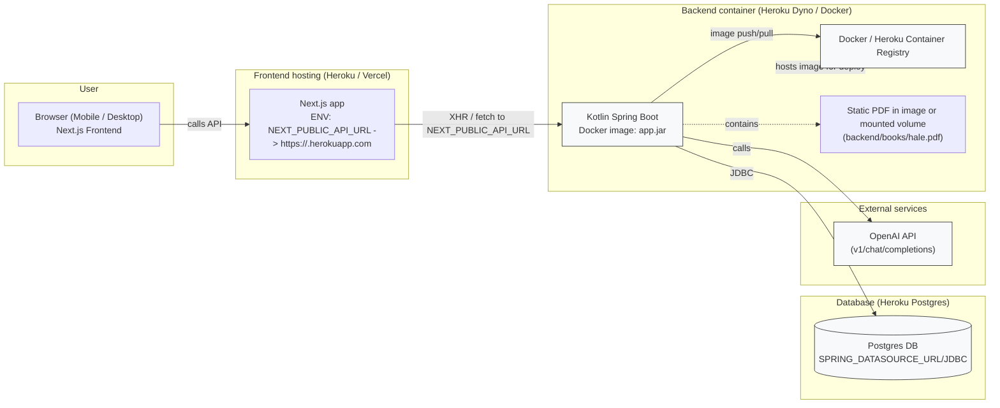

## Архитектурна диаграма — Frontend, Backend, Docker и база данни

По-долу има Mermaid диаграма и алтернативен ASCII вариант, описващи основните компоненти във вашия проект: Next.js фронтенд, Kotlin Spring Boot бекенд (в Docker контейнер), Postgres базата (Heroku Postgres), Docker Registry / Heroku Container Registry и външния OpenAI API. Всички описания са на български.

### Mermaid диаграма



### Обяснение (на български)

- Browser / Frontend: Потребителският интерфейс е Next.js приложение. То извиква бекенд API-то през променливата среда `NEXT_PUBLIC_API_URL`.
- Backend: Kotlin + Spring Boot приложение опаковано като Docker image (в `backend/container-build/app.jar`). При build процеса Gradle генерира bootJar, след което се билдва Docker image и се push-ва към Registry (Heroku Container Registry в нашия случай).
- Docker Registry: Тук се качва контейнерният образ; Heroku го използва за release на dyno.
- PDF (hale.pdf): Файловете за ingest (напр. `backend/books/hale.pdf`) обикновено са включени в контейнера по време на билд или могат да се монтират от постоянен storage. В момента проектът запазва `backend/books/hale.pdf` в кода и образа.
- Database: Приложението използва Postgres (Heroku Postgres). Heroku предоставя `DATABASE_URL`, която конвертираме към `SPRING_DATASOURCE_URL`, `SPRING_DATASOURCE_USERNAME`, `SPRING_DATASOURCE_PASSWORD`.
- External APIs: Backend-ът прави HTTP заявки към OpenAI API (изисква `OPENAI_API_KEY` в конфигурацията на Heroku). Ако ключът е с лимит/липсващ кредит, ще получите 429 (insufficient_quota).

### ASCII диаграма (бърз поглед в терминал)

Browser (Next.js)
  |
  |---> Frontend hosting (Heroku/Vercel) [NEXT_PUBLIC_API_URL]
            |
            |---> Backend (Kotlin Spring Boot) [Docker image]
                      |---> Postgres (Heroku Postgres) [JDBC]
                      |---> OpenAI API (external)
                      |---> (contains) backend/books/hale.pdf
                      |---> Image stored in Docker/Heroku Registry

### Как да визуализирате Mermaid диаграмата локално

1) Бърз (онлайн): отворете https://mermaid.live , поставете съдържанието на Mermaid блока и ще видите диаграмата мигновено.

2) Локално с mermaid-cli (генерира PNG/SVG):

```bash
# инсталирайте mermaid-cli (ако нямате)
npm install -g @mermaid-js/mermaid-cli

# запазете диаграмата в файл, напр. docs/architecture/diagram.mmd (можете да вземете Mermaid блока от този файл)
mmdc -i docs/architecture/diagram.mmd -o docs/architecture/diagram.png
```

3) VSCode: Инсталирайте разширението "Markdown Preview Mermaid Support" или "Mermaid Preview" и отворете `docs/architecture/architecture.md` за визуализация в редактора.

---

Ако желаете, мога:

- да генерирам и добавя PNG/SVG директно в репото (трябва да имам право да стартирам build в тази среда) или да ви покажa точните команди за локално производство; 
- да разширя диаграмата с повече детайли (напр. CORS flow, env vars, Flyway миграции, или CI/CD pipeline), или
- да направя PlantUML версия, ако предпочитате.

Кажете коя опция предпочитате и ще я добавя/генерирам следващо. 
